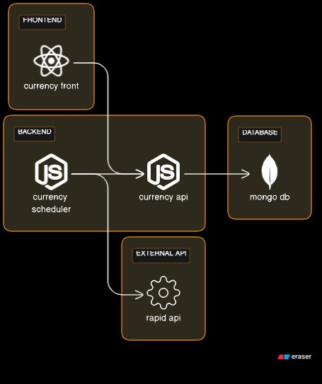

# Currency Converter Application

## Project Overview

This project is a set of applications utilizing Node.js, TypeScript, and React, developed by **Leonardo Delfino** (<leonardodelfino@gmail.com>). It interacts with the Currency Converter API to continuously fetch and display the currency conversion rates between USD and BRL for the last 24 hours. It is composed of multiple systems, including the front-end, back-end API, a cron job for data updates, and a MongoDB database.

This project serves as the resolution for the [Senior Engineer Homework Challenge](https://github.com/smartrr-hello/senior_engineer_homework), showcasing the author's expertise in building a robust and scalable currency conversion solution.

## Demo and Deployment

Explore a live demo of the Currency Converter Application by visiting [this link](https://currency-front-7b2cb0f6ab6e.herokuapp.com/).

Here's how the project is deployed:

- **currency-front**, **currency-api**, and **currency-scheduler** have been deployed to Heroku.
- The MongoDB database is hosted on MongoDB Atlas.

**Please note that due to cost considerations, the demo will be available until September 30th, 2023.**

## How to Run the Currency Converter Application

### Environment Setup and Start the Application 

1. **Copy Environment Configuration File**: Duplicate the `.env.example` file and rename it to `.env`. This file will contain your configuration settings.

   ```shell
   cp .env.example .env
   ```

2. Configure the .env File: Open the .env file in a text editor and set your RapidAPI key as follows:
    ```dotenv
    RAPID_API_KEY=your_api_key_here
    ```

3. Launch the Application: Start the Currency Converter Application using Docker Compose by running the following command in your project directory:
    ```bash
    docker-compose up
    ```


## Architecture Overview

### Architecture Diagram

Below is a high-level diagram representing the architecture of the Currency Converter Application:



### Services

- **currency-front**: This is the front-end of the application, developed in React and Typescript. It communicates with the `currency-api` to retrieve and display currency conversion rates.

- **currency-api**: The back-end API built with Node.js and TypeScript. It serves as the intermediary between the front-end and the database. This service also is responsible for handling requests from the `currency-scheduler` for data updates. Additionally, a MongoDB database is created within the same Docker environment to store currency conversion data. 


- **currency-scheduler**: A Node.js and Typescript application responsible for running scheduled jobs to fetch data from `rapid-api` and comunnicates the `currency-api` to save to database.

Each service has its own README explaining how to run the project.

### Why Three Services?

You might wonder why this project is structured into three distinct services: `currency-front`, `currency-api`, and `currency-scheduler`. This separation serves several crucial purposes:

1. **Modularity**: Breaking down the application into separate services enhances modularity. Each service has a specific responsibility and can be developed, tested, and scaled independently, making the entire system more maintainable.

2. **Scalability**: In real-world scenarios, different parts of an application may require different levels of scalability. By separating services, you can scale each component as needed. For instance, if your front-end experiences heavy traffic, you can scale the `currency-front` service without affecting the other parts.

3. **Isolation**: Isolation is critical for security and reliability. Separating services ensures that a failure or security issue in one part of the application is less likely to impact the entire system.

4. **Simplified Development**: Developers can focus on a single service, making it easier to manage and understand the codebase. This separation of concerns simplifies development and encourages clean code practices.

## TODO
- [ ] Implement token caching for the Currency API to avoid generating a new token for each request.
- [ ] Review the currently included modules and remove any that are not essential for the project to reduce complexity.
- [ ] Resolve issues that are preventing the successful utilization of Axios request mocking in test scenarios of currency-front.
- [ ] Implement an authentication mechanism to securely save and manage tokens, preventing the need to generate a new one for each request.
- [ ] Develop a token refresh method to maintain user sessions and ensure seamless access to protected resources.
- [ ] Investigate and resolve issues related to Swagger schema references to ensure accurate and consistent API documentation.

## License

This project is licensed under the [MIT License](LICENSE).
